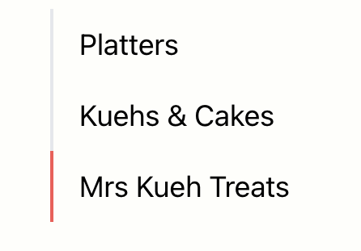
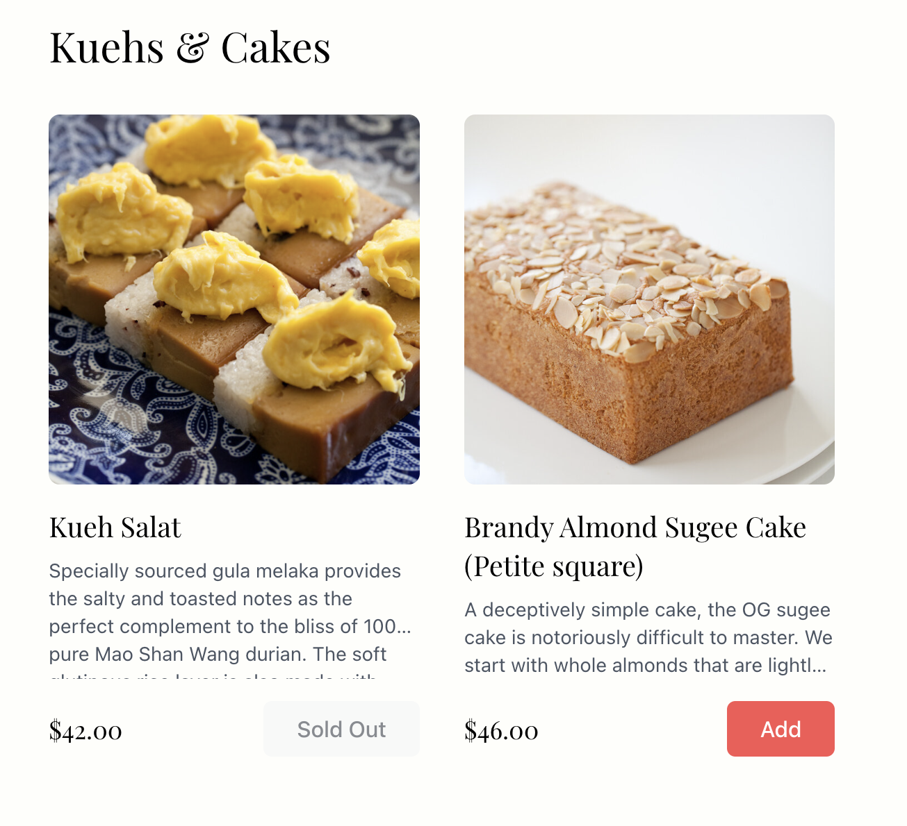
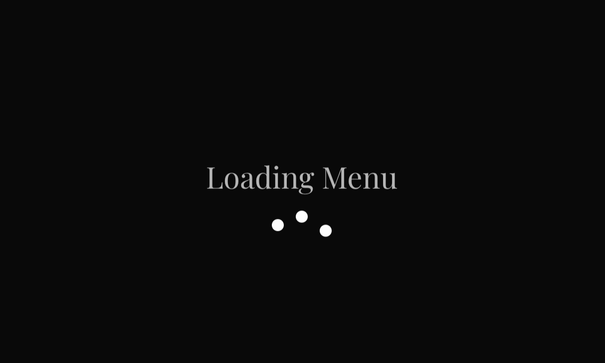
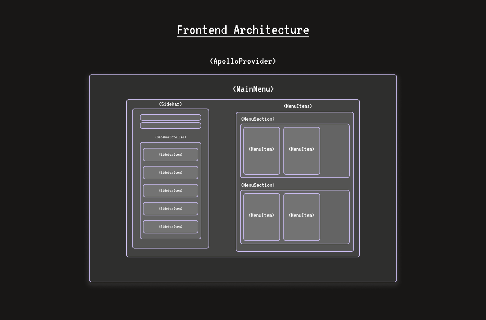

# 🍽️ GraphQL Restaurant Menu UI

A modern, responsive React application for displaying restaurant menus, built with TypeScript, Tailwind CSS, and Apollo Client. Features smooth animations, section navigation, and a polished user interface.

🌐 [Live Demo](https://graphql-restaurant-menu-ui.vercel.app/)

#### Completion time: 6h 10min

## 📑 Table of Contents

- [🎯 Goals](#-goals)
- [🚀 Project Setup](#-project-setup)
- [🧰 Tech Stack](#-tech-stack)
- [✨ Features](#-features)
- [🏗️ Component Architecture](#️-component-architecture)
- [💭 Thought Process](#-thought-process)
- [🌟 Conclusion](#-conclusion)

## 🎯 Goals

- Use React + Vite to create a frontend for a GraphQL API
- Use Apollo Client to handle GraphQL requests
- Use Framer Motion to create smooth animations
- Display menu with sections and sub-sections (sorted by display order prop)
- Add a modal for detailed item view
- Add an unavailable state for items / sections

## 🚀 Project Setup

### 📋 Prerequisites

- Node.js (LTS version)
- npm or yarn
- GraphQL API endpoint

### 💻 Installation

1. Clone the repository:

   ```bash
   git clone https://github.com/yourusername/graphql-restaurant-menu-ui.git
   cd graphql-restaurant-menu-ui
   ```

2. Install dependencies:

   ```bash
   npm install
   ```

3. Set up environment variables:

   ```bash
   cp .env.example .env
   ```

   Update `VITE_GRAPHQL_API_ENDPOINT` with your GraphQL server URL.

4. Start the development server:
   ```bash
   npm run dev
   ```

## 🧰 Tech Stack

- [TypeScript](https://www.typescriptlang.org/) - Typed JavaScript for better development experience
- [Tailwind CSS](https://tailwindcss.com/) - Utility-first CSS framework
- [Apollo Client](https://www.apollographql.com/docs/react/) - GraphQL client for state management
- [Framer Motion](https://www.framer.com/motion/) - Production-ready animation library
- [React](https://reactjs.org/) - UI component library
- [Vite](https://vitejs.dev/) - Next generation frontend tooling

## ✨ Features

### 🗺️ Menu Navigation



- Smooth scrolling section navigation
- Active section tracking
- Responsive sidebar that adapts to mobile and desktop views
- Animated section transitions

### 🍕 Menu Items Display



- Grid layout with responsive design
- Item availability status
- Modal for detailed item view

### 🎨 User Interface



- Modern, clean design
- Responsive layout
- Loading states and animations

## 🏗️ Architecture




### 🧱 Core Components

- `MainMenu`: Main container component
- `Sidebar`: Navigation component
- `MenuItems`: Items display container
- `MenuSection`: Section component
- `MenuItem`: Individual item card
- `ProductDetails`: Item detail modal

### 🎣 Custom Hooks

- `useActiveSection`: Tracks active menu section
- `useScrollLock`: Manages scroll behavior for modals
- `useFixedOnScroll`: Handles fixed positioning on scroll

### 🔄 Shared Components

- `Button`: Reusable button component with variants
- `MenuLoader`: Loading state component

## 💭 Thought Process

#### 1. **Starting with Component Architecture**

I began by focusing on the component structure first because that would define how the application would scale and how state would flow. My initial approach was to create a modular system where components could be easily reused and maintained:

- **Why Modular First?** I chose to start with a modular approach because it allowed me to isolate functionality and state management, making the codebase more maintainable and testable. Each component was designed to handle a specific responsibility, following the single responsibility principle.
- During this phase, I created basic versions of core components like `MenuItem` and `MenuSection`, testing their interactions and ensuring they could handle the required data flow using mock data.
- **Why Mock Data?** I used mock data to test the components and ensure they were working as expected. This allowed me to focus on the component logic without having to worry about the data flow from the GraphQL API. Transitioning to the Apollo Client was easier as I already had a good understanding of the data flow and the components after prototyping.

#### 2. **Integrating Apollo Client for GraphQL**

The integration of Apollo Client was a crucial part of the application architecture:

- **Why Apollo Client?** Apollo Client is a robust caching system and seamless integration with React. It provides a clean way to manage both remote data and local state, making it ideal for handling GraphQL data. It works out of the box with little configuration required.

- **Challenges Faced**:

- Data flow: One of the main challenges was structuring the architecture to handle the data flow from the GraphQL API. Every component needed to be able to access the menu data and update the UI accordingly in a way that was easy to maintain and scale.
- Queries: The queries need to be concise and specific to the data that is needed. This is by design as it's meant to handle over fetching and under fetching.
- Schemas: Always double check the schema structure and the data that is returned. Apollo's queries rely heavily on the schema.

#### 3. **Implementing Scroll-Based Navigation**

One of the key challenges was implementing smooth, performant scroll-based navigation. This involved several considerations:

- **Performance**: Using the Intersection Observer API instead of scroll events for better performance
- **User Experience**: Implementing smooth scrolling with proper easing
- **State Management**: Creating a custom hook (`useActiveSection`) to manage the active section state

The solution involved:

```typescript
const useActiveSection = (sections: string[]) => {
  // Using Intersection Observer for performance
  // Debouncing section changes to prevent flicker
  // Managing active state with proper thresholds
};
```

#### 4. **Modal and Scroll Lock Implementation**

The modal system needed to handle:

- Proper focus management for accessibility
- Scroll locking without layout shifts
- Smooth animations for opening/closing

I created the `useScrollLock` hook to manage this:

```typescript
const useScrollLock = (isLocked: boolean) => {
  useEffect(() => {
    // Manage body scroll while preserving layout
  }, [isLocked]);
};
```

#### 5. **Animation Strategy**

The animation system was built with Framer Motion to provide:

- Consistent animation patterns
- Proper exit animations for unmounting components

Example of the staggered animation implementation:

```typescript
const container = {
  hidden: { opacity: 0 },
  show: {
    opacity: 1,
    transition: {
      staggerChildren: 0.2,
      delayChildren: 0.1,
    },
  },
};
```

#### 6. **Responsive Design Implementation**

The responsive design was implemented using:

- Mobile-first approach with Tailwind CSS
- Dynamic grid layouts that adapt to screen size
- Flexible component design that scales properly

## 🌟 Conclusion

This project was a great learning experience that allowed me to explore the potential of GraphQL and React in building highly scalable and performant applications.

Combined with the Apollo Client, building this application's frontend was a breeze. Querying the data is simple and the Apollo Provider makes it easy to manage the data flow.

The modular architecture allows for easy expansion and maintenance, so anyone can jump in and start building on top of this.

Let me know if you need further elaboration on any part of the process or if you'd like to explore next steps!
